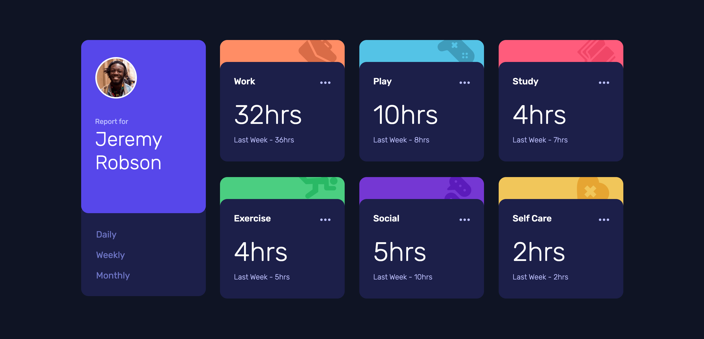

<h1 align="center">
    Time Tracking Dashboard
</h1>



<h2 align="center">
    A Frontendmentor project :rocket:
</h2>
<p align="center">
  
  <br />
  
  <br />
    
</p>

<p align="center">
  <a href="#rocket-technologies">Technologies</a>&nbsp;&nbsp;&nbsp;|&nbsp;&nbsp;&nbsp;
    <a href="https://time-tracking-dashboard-react-ochre.vercel.app/" target="_blank">Live demo</a>&nbsp;
    &nbsp;&nbsp;|&nbsp;&nbsp;&nbsp;
    <a href="https://www.frontendmentor.io/challenges/time-tracking-dashboard-UIQ7167Jw/hub/time-tracking-dashboard-using-react-typescript-95AHn4jKr" target="_blank">Frontendmentor page</a>&nbsp;&nbsp;&nbsp;
</p>


## :rocket: Technologies

- [ReactJS](https://reactjs.org/)
- [ViteJS](https://vitejs.dev/)
- [Redux](https://redux.js.org/)
- [Styled Components](https://styled-components.com/)
- [Polish](https://polished.js.org/)

## :information_source: How To Use

To clone and run this application, you'll need [Git](https://git-scm.com), [Node.js v8.16][nodejs] or higher + [Yarn v1.22][yarn] or higher installed on your computer. From your command line:

```bash
# Clone this repository
$ git clone https://github.com/kdumagalhaes/time-tracking-dashboard-react.git

# Go into the repository
$ cd time-tracking-dashboard-react

# Install dependencies
$ yarn

# Run the app
$ yarn dev

```

---

Made with ♥ by Carlos :wave: [Get in touch!](https://www.linkedin.com/in/kdumagalhaes/)

[nodejs]: https://nodejs.org/
[yarn]: https://yarnpkg.com/
[vc]: https://code.visualstudio.com/
[vceditconfig]: https://marketplace.visualstudio.com/items?itemName=EditorConfig.EditorConfig
[vceslint]: https://marketplace.visualstudio.com/items?itemName=dbaeumer.vscode-eslint
